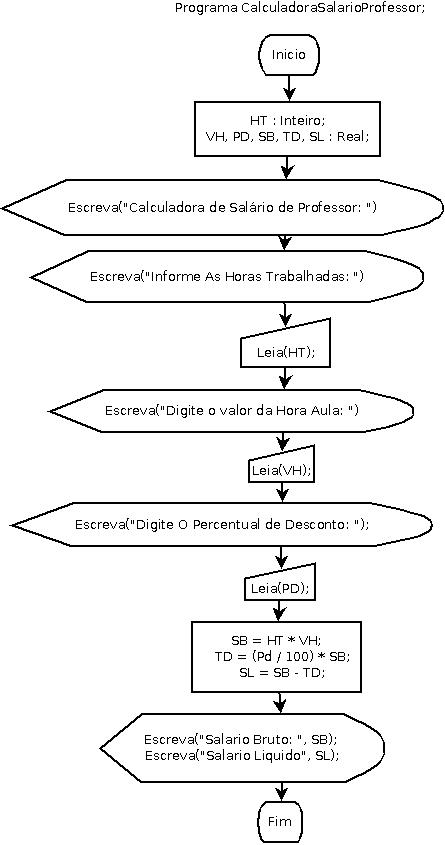

# CalculadoraSalarioProfessorEmDiagramadeBloco

**Calculadora de Salario de Professor Em Diagrama de Blocos | Fluxograma**

## Enunciado

**Desenvolver um programa que calcule o salário liquido de um professor.**

   

Autor: Erick Leite Freire 
Criado em: 03-11-2023 
Site: [Escola do Autodidata](https://www.escoladoautodidata.com.br) 
